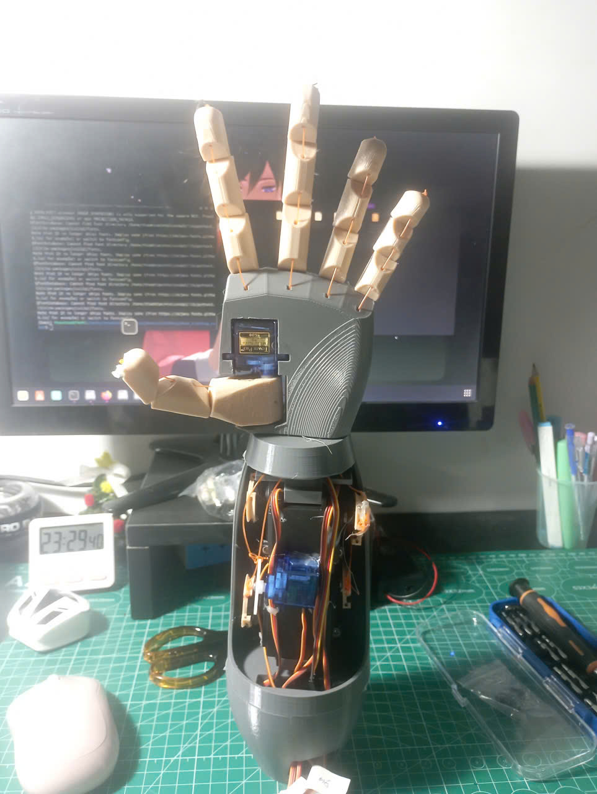
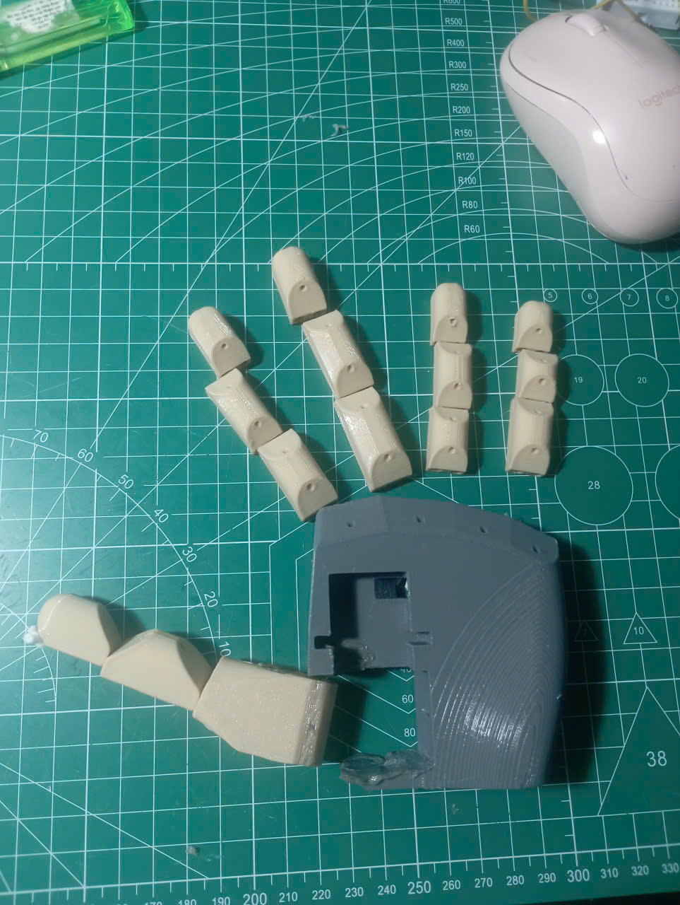
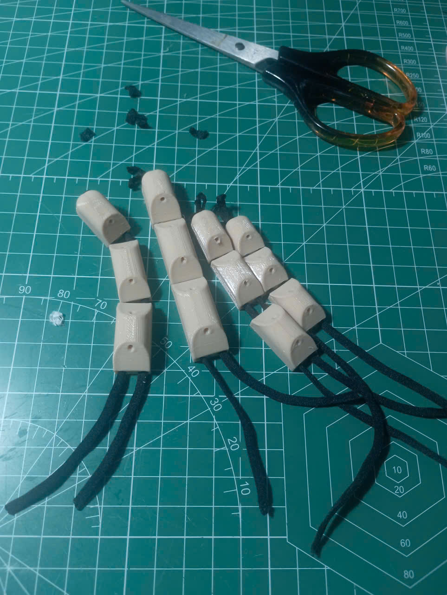
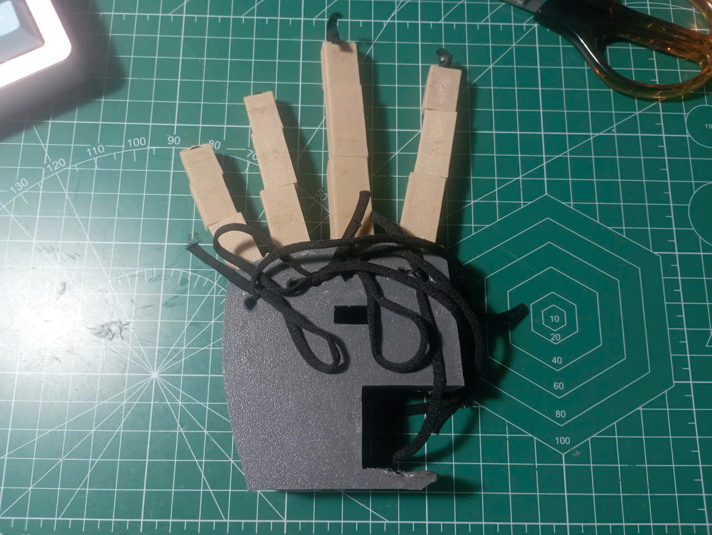
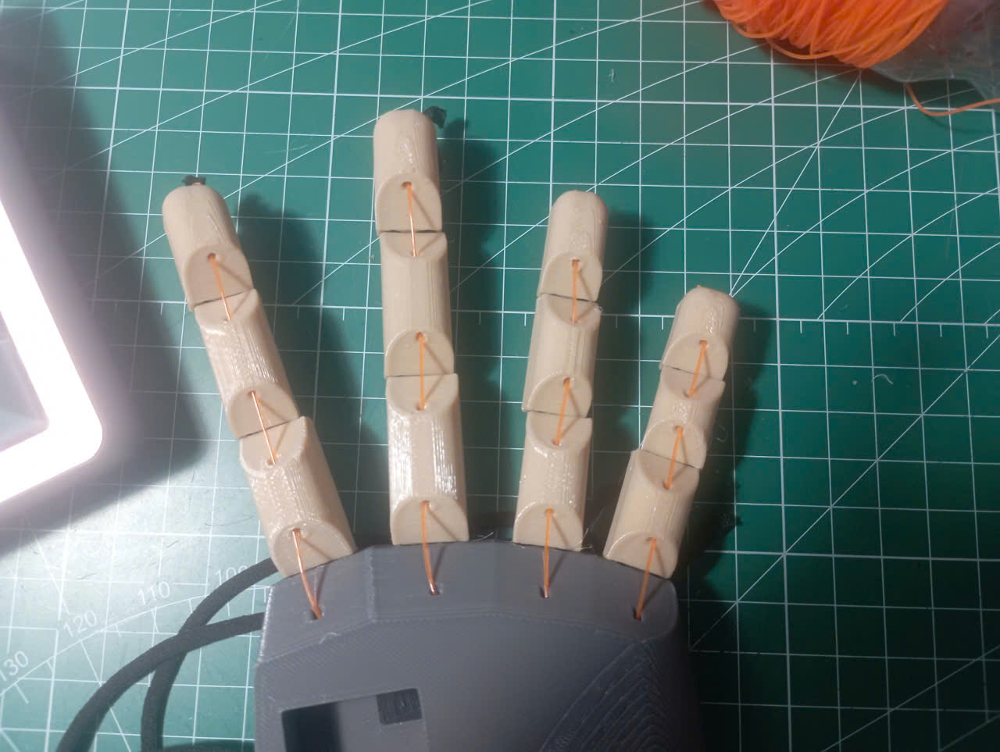
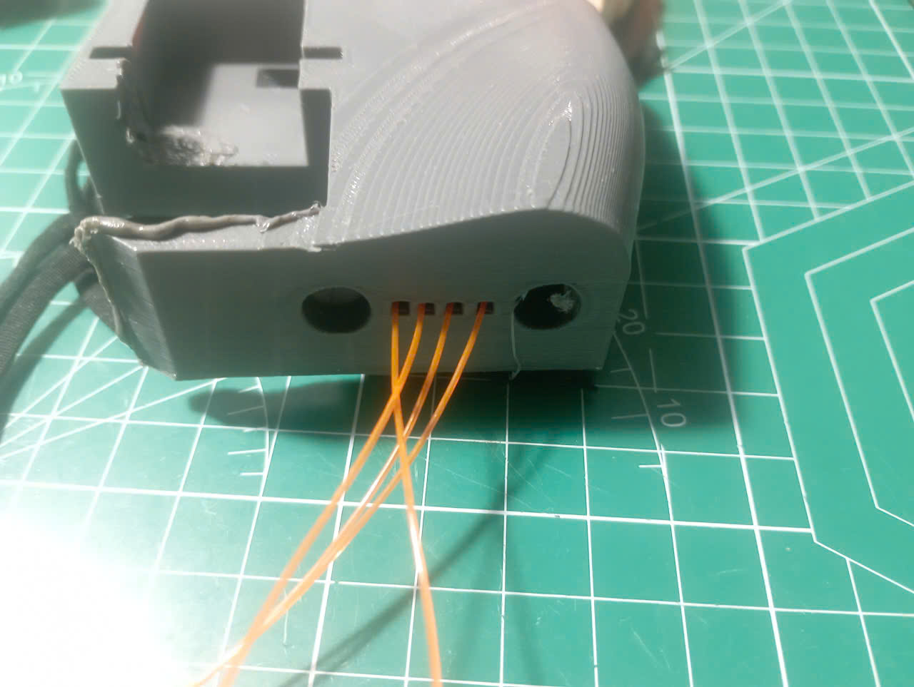
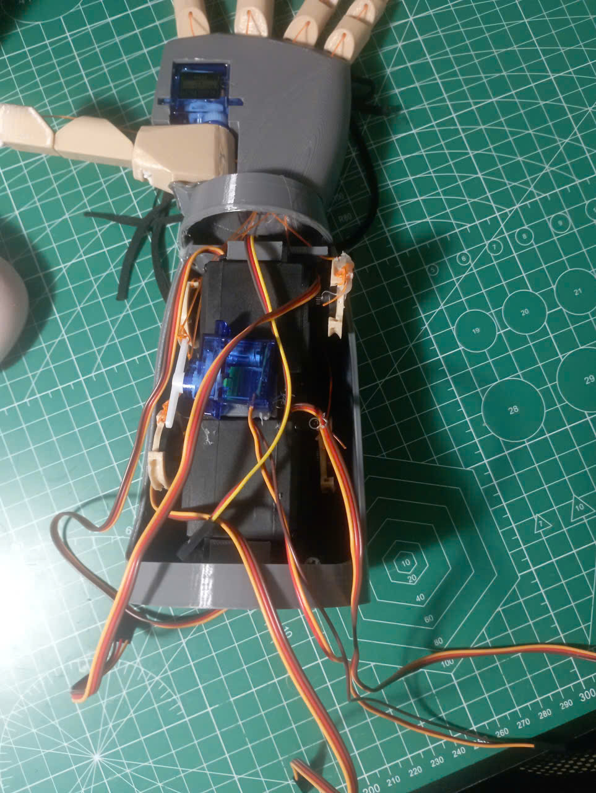
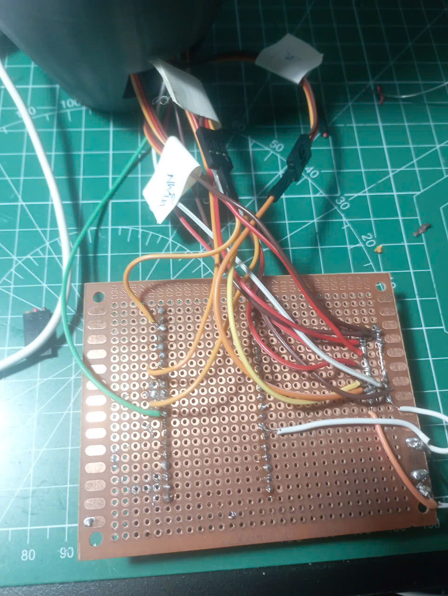
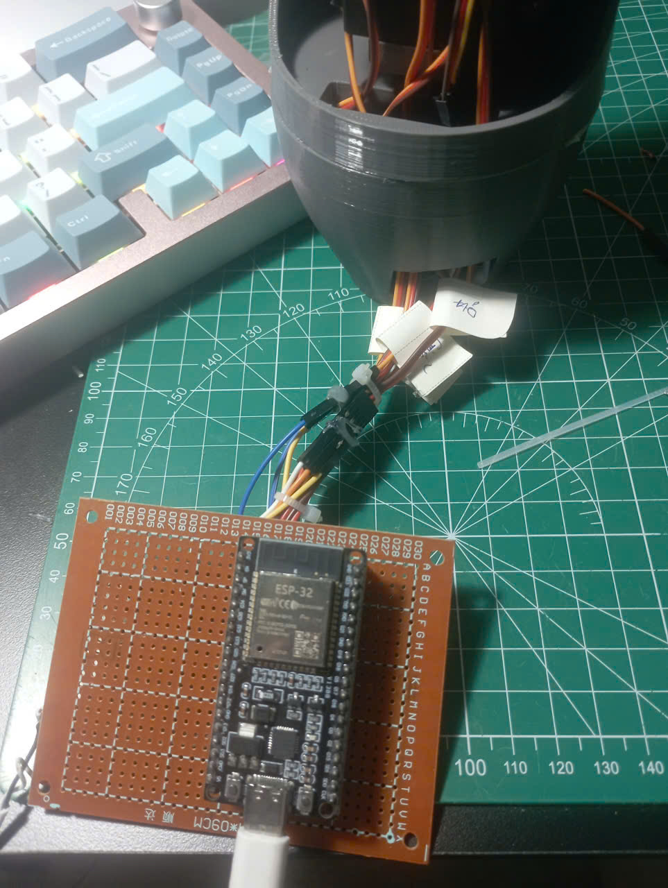

#  Gesture Hand Recognition

Hệ thống nhận diện cử chỉ tay sử dụng **MediaPipe + OpenCV + Python** để điều khiển thiết bị (ESP32).
---
## Thông tin
* Code nhúng vào ESP32 được upload và build trên PlatformIO.
---

## 📸 Demo



---

## 🎯 Tính năng

* Nhận diện ngón tay theo thời gian thực
* Gửi dữ liệu qua socket tới ESP32

---

## ⚙️ Công nghệ sử dụng

* Python
* OpenCV
* MediaPipe
* Socket (UDP)
* ESP32

---
## 🔧 Cách lắp đặt cánh tay

### Bước 1


### Bước 2


### Bước 3


### Bước 4


### Bước 5


### Bước 6


### Bước 7


### Bước 8


---
## 🚀 Cài đặt 

```bash
pip install opencv-python mediapipe numpy
```
* thêm thư viện json vào file platformio.ini
```bash
lib_deps =
    bblanchon/ArduinoJson
```

---

## ▶️ Chạy chương trình

```bash
python hand_tracking.py
```

---

## 📡 Kết nối ESP32

* IP: `192.168.1.xxx`
* Port: `4210`

---

## 👨‍💻 Tác giả

* ThnhT4m
